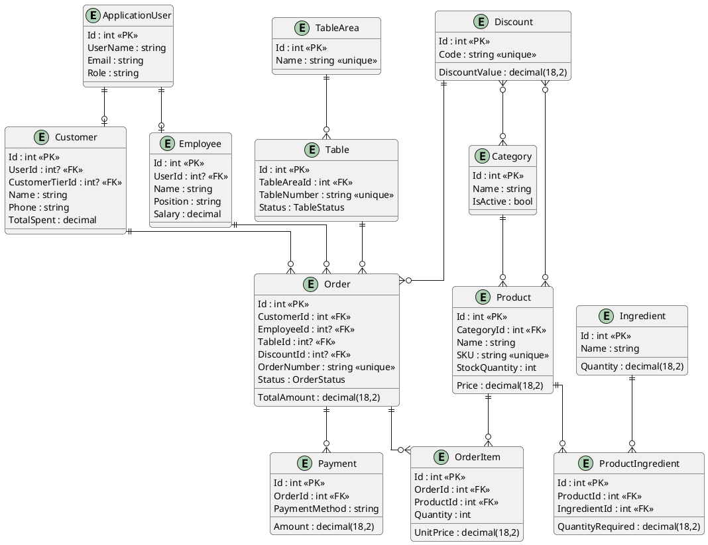

# 📊 BÁO CÁO ĐỒ ÁN TỐT NGHIỆP
## HỆ THỐNG QUẢN LÝ CỬA HÀNG THỨC ĂN NHANH

**Sinh viên:** Trần Thái Thiên  
**MSSV:** 1050080202

---

## SLIDE 1: TRANG BÌA
**HỆ THỐNG QUẢN LÝ CỬA HÀNG THỨC ĂN NHANH**

Đồ án tốt nghiệp  
Sinh viên: Trần Thái Thiên - MSSV: 1050080202  
Giảng viên hướng dẫn: [Tên GVHD]

---

## SLIDE 2: GIỚI THIỆU DỰ ÁN
**Mục tiêu:**
- Xây dựng hệ thống quản lý toàn diện cho cửa hàng thức ăn nhanh
- Quản lý đơn hàng, sản phẩm, khách hàng, nhân viên
- Hệ thống POS (Point of Sale) tích hợp
- Báo cáo và thống kê doanh thu

**Công nghệ sử dụng:**
- **Backend:** C# .NET 8.0, Entity Framework Core, SQL Server
- **Frontend:** React 19 + TypeScript, Vite, PWA
- **Kiến trúc:** 3-Layer Architecture (Presentation, Application, Data)

---

## SLIDE 3: GIAI ĐOẠN 1 - THIẾT KẾ DATABASE
**Mục tiêu:** Thiết kế cơ sở dữ liệu đảm bảo tính toàn vẹn và hiệu suất

**Kết quả đạt được:**

### 3.1. Các bảng chính (15 bảng):
1. **ApplicationUser** - Quản lý tài khoản người dùng
2. **Category** - Danh mục sản phẩm
3. **Product** - Sản phẩm
4. **Ingredient** - Nguyên liệu
5. **ProductIngredient** - Công thức sản phẩm (Many-to-Many)
6. **Customer** - Khách hàng
7. **CustomerTier** - Hạng khách hàng (VIP, Gold, Silver)
8. **Employee** - Nhân viên
9. **Order** - Đơn hàng
10. **OrderItem** - Chi tiết đơn hàng
11. **Payment** - Thanh toán
12. **Table** - Bàn ăn
13. **TableArea** - Khu vực bàn
14. **WorkShift** - Ca làm việc
15. **Discount** - Mã giảm giá

### 3.2. Quan hệ giữa các bảng:
- **One-to-Many:** Category → Products, Customer → Orders, Order → OrderItems
- **Many-to-Many:** Product ↔ Ingredients, Discount ↔ Products/Categories
- **One-to-One:** Customer ↔ ApplicationUser, Employee ↔ ApplicationUser

### 3.3. Tính năng nổi bật:
- ✅ Indexes tối ưu cho truy vấn (SKU, OrderNumber, TransactionId)
- ✅ Decimal precision (18,2) cho các trường tiền tệ
- ✅ Cascade delete cho OrderItems, Payments
- ✅ Restrict delete cho Products, Customers (bảo toàn dữ liệu)
- ✅ Unique constraints (SKU, OrderNumber, TableNumber)

---

## SLIDE 4: GIAI ĐOẠN 1 - THIẾT KẾ DATABASE (Tiếp)
**Sơ đồ quan hệ chính (PlantUML):**



**Mô tả quan hệ:**
- **One-to-One:** ApplicationUser ↔ Customer/Employee
- **One-to-Many:** Category → Products, Customer → Orders, Order → OrderItems, Order → Payments
- **Many-to-Many:** Product ↔ Ingredients (qua ProductIngredient), Discount ↔ Products/Categories

**Migrations:**
- ✅ 15 Migration files đã tạo
- ✅ Database schema hoàn chỉnh
- ✅ Seed data sẵn sàng

---

## SLIDE 5: GIAI ĐOẠN 2 - THIẾT KẾ BACKEND
**Mục tiêu:** Xây dựng API server xử lý logic nghiệp vụ, kết nối database

**Kết quả đạt được:**

### 5.1. Kiến trúc Backend:
- **Framework:** ASP.NET Core 8.0 Web API
- **ORM:** Entity Framework Core
- **Database:** SQL Server
- **Authentication:** JWT Bearer Token
- **Real-time:** SignalR Hub
- **Documentation:** Swagger/OpenAPI

### 5.2. Controllers (17 Controllers):
1. **AuthController** - Đăng nhập, xác thực JWT
2. **CategoriesController** - CRUD danh mục
3. **ProductsController** - CRUD sản phẩm
4. **IngredientsController** - CRUD nguyên liệu
5. **CustomersController** - CRUD khách hàng
6. **EmployeesController** - CRUD nhân viên + tạo tài khoản
7. **OrdersController** - CRUD đơn hàng
8. **OrderItemsController** - Quản lý chi tiết đơn hàng
9. **PaymentsController** - Quản lý thanh toán
10. **TablesController** - Quản lý bàn ăn
11. **CustomerTiersController** - Quản lý hạng khách hàng
12. **DiscountsController** - Quản lý mã giảm giá
13. **ReportsController** - Báo cáo và thống kê
14. **ExportController** - Xuất Excel
15. **FileUploadController** - Upload ảnh
16. **ProductIngredientsController** - Quản lý công thức
17. **ShiftsController** - Quản lý ca làm việc

---

## SLIDE 6: GIAI ĐOẠN 2 - THIẾT KẾ BACKEND (Tiếp)
**API Endpoints chính:**

### Authentication & Authorization:
- `POST /api/auth/login` - Đăng nhập
- `GET /api/auth/me` - Thông tin user hiện tại

### Quản lý nghiệp vụ:
- **Products:** 10+ endpoints (CRUD, search, low-stock, category filter)
- **Orders:** 8+ endpoints (CRUD, status update, filter by customer/status)
- **Payments:** 5+ endpoints (CRUD, confirm payment, filter)
- **Reports:** 4+ endpoints (dashboard stats, sales report, charts)

### Tính năng nâng cao:
- ✅ **JWT Authentication** - Bảo mật với token
- ✅ **SignalR Real-time** - Thông báo đơn hàng mới, cập nhật trạng thái
- ✅ **Excel Export** - Xuất báo cáo doanh thu, sản phẩm, tồn kho
- ✅ **File Upload** - Upload ảnh sản phẩm (max 5MB)
- ✅ **Response Caching** - Tối ưu hiệu suất
- ✅ **Swagger Documentation** - Tài liệu API tự động

**Tổng cộng: 50+ API Endpoints**

---

## SLIDE 7: GIAI ĐOẠN 2 - THIẾT KẾ BACKEND (Tiếp)
**Tính năng báo cáo và thống kê:**

### ReportsController:
- **Dashboard Statistics:**
  - Doanh thu (Today, Week, Month, Year)
  - Số lượng đơn hàng
  - Thống kê tổng quan (Customers, Products, Employees, Tables)
  - Cảnh báo tồn kho thấp
  - Top 10 sản phẩm bán chạy

- **Sales Report:**
  - Lọc theo ngày, tháng, năm
  - Lọc theo danh mục, nhân viên
  - Biểu đồ doanh thu
  - Hiệu suất sản phẩm

- **Excel Export:**
  - Báo cáo doanh thu (3 sheets: Tổng quan, Chi tiết, Sản phẩm)
  - Danh sách sản phẩm
  - Báo cáo tồn kho

**Security:**
- ✅ JWT Token validation
- ✅ Role-based authorization (Admin, Cashier, WarehouseStaff)
- ✅ CORS configuration
- ✅ Input validation

---

## SLIDE 8: GIAI ĐOẠN 3 - THIẾT KẾ FRONTEND
**Mục tiêu:** Xây dựng giao diện người dùng hiện đại, responsive, dễ sử dụng

**Kết quả đạt được:**

### 8.1. Công nghệ Frontend:
- **Framework:** React 19 + TypeScript
- **Build Tool:** Vite 7.x (Build nhanh)
- **Routing:** React Router DOM 7.x
- **State Management:** React Context API
- **HTTP Client:** Axios
- **PWA:** Progressive Web App (có thể cài đặt như app)
- **Charts:** Recharts
- **Notifications:** React Toastify

### 8.2. Kiến trúc Frontend:
```
src/
├── api/          # API services (14 files)
├── components/   # Reusable components
├── contexts/     # AuthContext
├── pages/        # 17 pages
├── utils/         # Utilities (toast, helpers)
└── App.tsx       # Main app với routing
```

---

## SLIDE 9: GIAI ĐOẠN 3 - THIẾT KẾ FRONTEND (Tiếp)
**Các trang chính (17 Pages):**

### Quản lý hệ thống:
1. **AdminDashboard** - Trang chủ admin
2. **AdminDashboardPage** - Dashboard với thống kê và biểu đồ
3. **ReportsPage** - Báo cáo chi tiết với filters và export Excel
4. **EmployeesPage** - Quản lý nhân viên + tạo tài khoản
5. **CustomersPage** - Quản lý khách hàng
6. **CategoriesPage** - Quản lý danh mục
7. **ProductsPage** - Quản lý sản phẩm + công thức
8. **IngredientsPage** - Quản lý nguyên liệu
9. **DiscountsPage** - Quản lý mã giảm giá

### Quản lý nghiệp vụ:
10. **OrdersPage** - Quản lý đơn hàng
11. **PaymentsPage** - Quản lý thanh toán + thống kê
12. **TablesPage** - Xem trạng thái bàn, đóng bàn, chuyển bàn
13. **TableManagementPage** - CRUD bàn và khu vực
14. **ShiftManagementPage** - Quản lý ca làm việc

### Hệ thống POS:
15. **POSPage** - Màn hình bán hàng (thêm sản phẩm, giảm giá, tạo đơn)
16. **PaymentPage** - Màn hình thanh toán (tính tiền, in hóa đơn)

### Xác thực:
17. **LoginPage** - Đăng nhập

---

## SLIDE 10: GIAI ĐOẠN 3 - THIẾT KẾ FRONTEND (Tiếp)
**Tính năng nổi bật:**

### 1. Authentication & Authorization:
- ✅ JWT Token authentication
- ✅ Protected routes (role-based)
- ✅ Auto-logout khi token hết hạn
- ✅ Context API quản lý user state

### 2. UI/UX Features:
- ✅ **Responsive Design** - Tương thích mobile, tablet, desktop
- ✅ **Modal Dialogs** - Form tạo/sửa/xóa
- ✅ **Toast Notifications** - Thông báo thành công/lỗi
- ✅ **Loading States** - Spinner khi tải dữ liệu
- ✅ **Error Boundary** - Xử lý lỗi React gracefully
- ✅ **Lazy Loading** - Code splitting, tối ưu performance

### 3. Advanced Features:
- ✅ **Charts & Graphs** - Recharts (Line, Bar, Pie charts)
- ✅ **Excel Export** - Download báo cáo Excel
- ✅ **Search & Filters** - Tìm kiếm và lọc dữ liệu
- ✅ **Pagination** - Phân trang cho bảng dữ liệu
- ✅ **Real-time Updates** - (Sẵn sàng tích hợp SignalR)

---

## SLIDE 11: GIAI ĐOẠN 3 - THIẾT KẾ FRONTEND (Tiếp)
**Hệ thống POS (Point of Sale):**

### POSPage - Màn hình bán hàng:
- ✅ Hiển thị sản phẩm theo danh mục
- ✅ Tìm kiếm sản phẩm
- ✅ Thêm sản phẩm vào giỏ hàng
- ✅ Chỉnh sửa số lượng, ghi chú
- ✅ Chọn loại đơn (Dine-in, Takeaway)
- ✅ Chọn bàn (nếu Dine-in)
- ✅ Áp dụng mã giảm giá
- ✅ Tính tổng tiền (có VAT, phí giao hàng)
- ✅ Tạo đơn hàng

### PaymentPage - Màn hình thanh toán:
- ✅ Hiển thị chi tiết đơn hàng
- ✅ Chọn khách hàng (tìm kiếm, tạo mới)
- ✅ Chọn phương thức thanh toán (Tiền mặt, Thẻ, MoMo, Chuyển khoản)
- ✅ Nhập số tiền nhận, tính tiền thừa
- ✅ Xác nhận thanh toán
- ✅ In hóa đơn (Invoice)
- ✅ Cập nhật trạng thái bàn

---

## SLIDE 12: TỔNG KẾT KẾT QUẢ
**Thống kê dự án:**

### Database:
- ✅ **15 bảng** với quan hệ đầy đủ
- ✅ **15 Migration files**
- ✅ Indexes và constraints tối ưu
- ✅ Decimal precision cho tiền tệ

### Backend:
- ✅ **17 Controllers**
- ✅ **50+ API Endpoints**
- ✅ **JWT Authentication**
- ✅ **SignalR Real-time**
- ✅ **Excel Export**
- ✅ **File Upload**
- ✅ **Swagger Documentation**

### Frontend:
- ✅ **17 Pages**
- ✅ **14 API Services**
- ✅ **7 Components**
- ✅ **PWA Support**
- ✅ **Responsive Design**
- ✅ **Charts & Reports**

### Tính năng hoàn thành:
- ✅ **80%** tính năng core (8/10 tasks)
- ✅ **100%** backend APIs
- ✅ **CRUD đầy đủ** cho tất cả entities
- ✅ **Role-based access control**
- ✅ **Báo cáo và thống kê**

---

## SLIDE 13: DEMO & SCREENSHOTS
**Các màn hình chính:**

1. **Login Page** - Đăng nhập với username/password
2. **Admin Dashboard** - Thống kê tổng quan, biểu đồ doanh thu
3. **POS Page** - Màn hình bán hàng với giỏ hàng
4. **Payment Page** - Màn hình thanh toán và in hóa đơn
5. **Products Page** - Quản lý sản phẩm với công thức
6. **Orders Page** - Danh sách đơn hàng với filters
7. **Reports Page** - Báo cáo với biểu đồ và export Excel
8. **Tables Page** - Quản lý trạng thái bàn

*(Có thể chèn screenshots thực tế vào slide này)*

---

## SLIDE 14: KẾT LUẬN
**Những gì đã đạt được:**

### ✅ Hoàn thành:
1. **Database Design** - Schema hoàn chỉnh, tối ưu
2. **Backend API** - 50+ endpoints, đầy đủ tính năng
3. **Frontend UI** - 17 pages, responsive, modern
4. **Authentication** - JWT, role-based access
5. **POS System** - Hệ thống bán hàng hoàn chỉnh
6. **Reports** - Báo cáo và thống kê với charts
7. **Excel Export** - Xuất báo cáo Excel
8. **PWA** - Có thể cài đặt như app

### 🎯 Điểm mạnh:
- ✅ Kiến trúc rõ ràng, dễ bảo trì
- ✅ Code quality tốt (TypeScript, modular)
- ✅ UI/UX hiện đại, dễ sử dụng
- ✅ Performance tối ưu (lazy loading, caching)
- ✅ Security tốt (JWT, validation)

### 📈 Hướng phát triển:
- ⏳ SignalR real-time notifications
- ⏳ Product image upload UI
- ⏳ Mobile app (React Native)
- ⏳ Multi-store support

---

## SLIDE 15: CẢM ƠN
**Xin chân thành cảm ơn!**

Cảm ơn Giảng viên hướng dẫn đã tận tình hướng dẫn trong suốt quá trình làm đồ án.

**Hệ thống đã sẵn sàng để:**
- ✅ Demo và thuyết trình
- ✅ Testing và đánh giá
- ✅ Triển khai thực tế

**Liên hệ:**
- Sinh viên: Trần Thái Thiên
- MSSV: 1050080202

---

## PHỤ LỤC: CẤU TRÚC DỰ ÁN

```
DoAnTotNghiep/
├── fastfood/              # Backend (.NET 8.0)
│   ├── fastfood/
│   │   ├── Controllers/   # 17 Controllers
│   │   ├── Data/          # DbContext
│   │   ├── Hubs/          # SignalR Hub
│   │   └── Migrations/    # 15 Migrations
│   └── fastfood.Shared/
│       ├── Models/        # 15 Models
│       └── DTOs/          # 55 DTOs
│
└── fe/                    # Frontend (React + TypeScript)
    ├── src/
    │   ├── api/           # 14 API services
    │   ├── components/    # 7 Components
    │   ├── contexts/      # AuthContext
    │   ├── pages/         # 17 Pages
    │   └── utils/         # Utilities
    └── package.json
```

---

**Tổng số slides: 15 slides**  
**Thời gian trình bày: ~15-20 phút**

